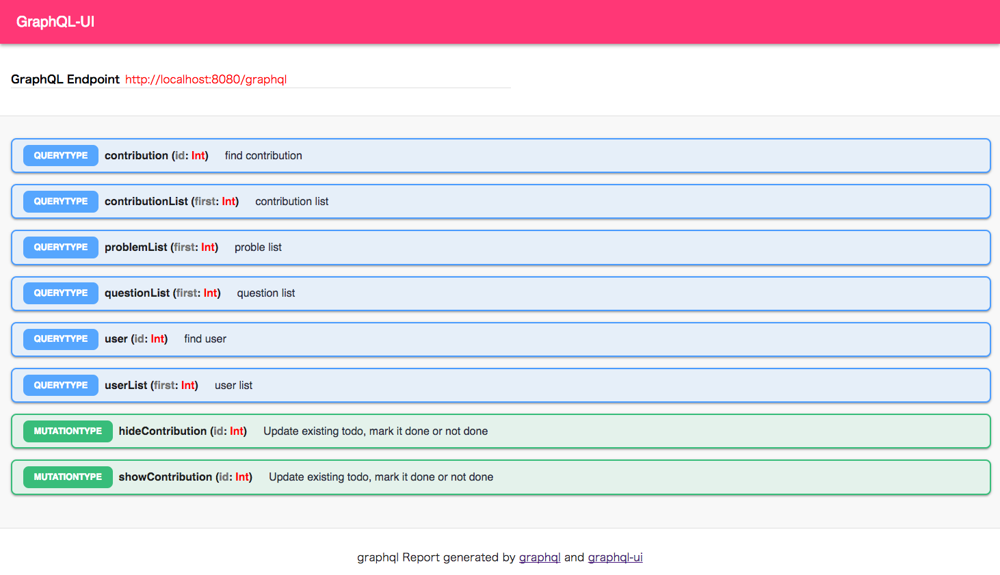
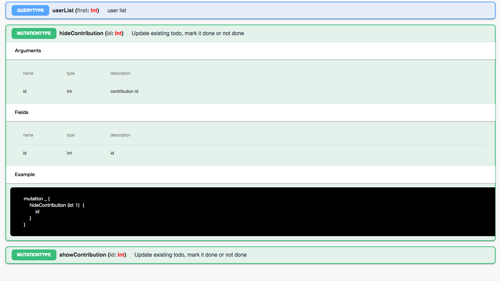

# graphql-ui


graphql document generate command line tool





### Usage


```sh
npm i -g graphql-ui

 or

npm i --save-dev graphql-ui
```

Run the output reports
```sh
$ graphql-ui http://localhost:8080/graphql

$ ls graphql-ui-reports/
 bundle		index.html

```
